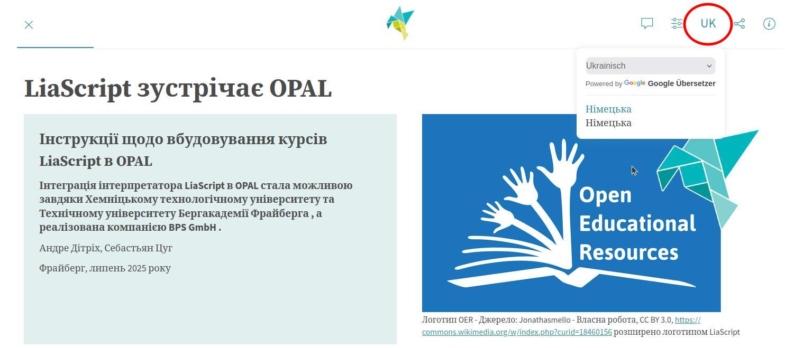
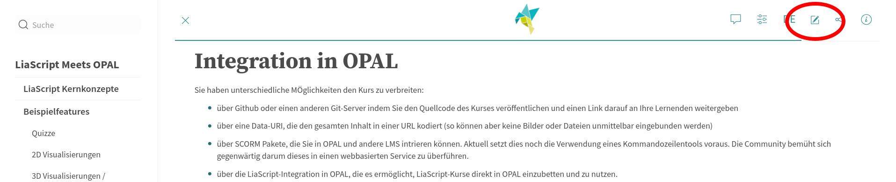
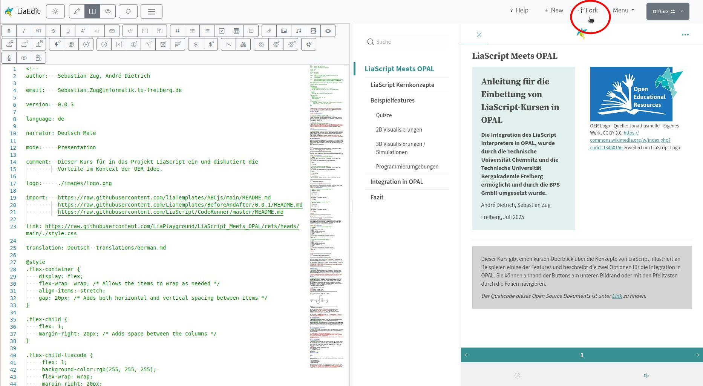
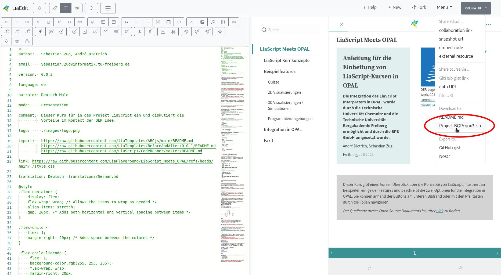
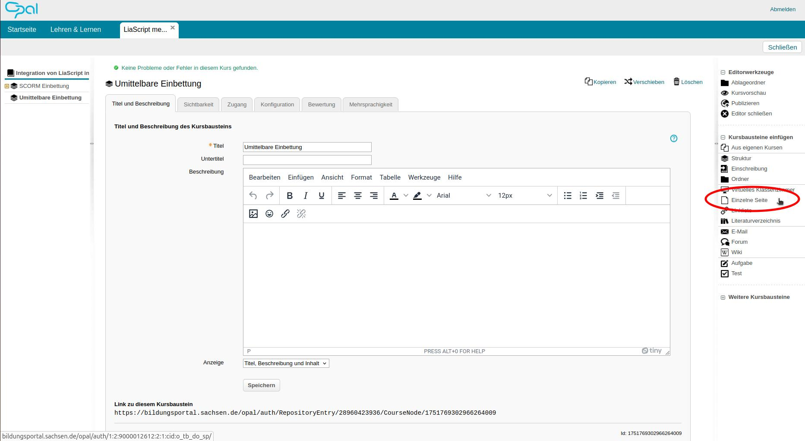
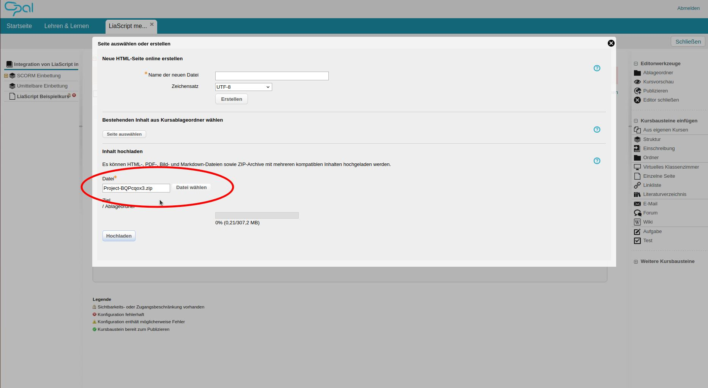
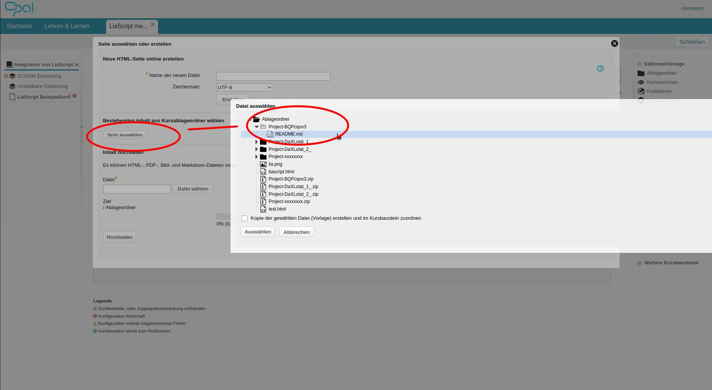
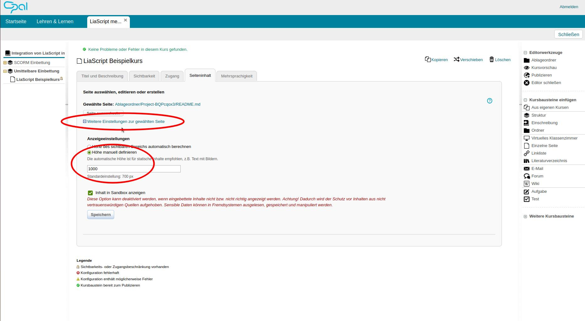
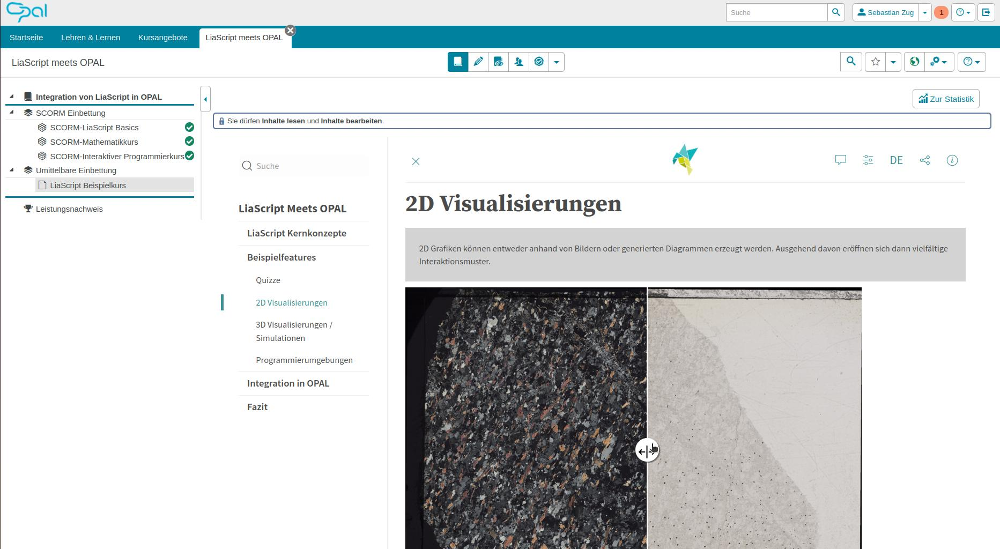

<!--
author:   Sebastian Zug, André Dietrich

email:    Sebastian.Zug@informatik.tu-freiberg.de

version:  0.0.4

language: de

narrator: Deutsch Male

mode:     Presentation

edit:     https://liascript.github.io/LiveEditor/?/show/file/https://raw.githubusercontent.com/LiaPlayground/LiaScript_Meets_OPAL/refs/heads/main/README.md

comment:  Dieser Kurs für in das Projekt LiaScript ein und diskutiert die
          Vorteile im Kontext der OER Idee.

logo:     ./images/logo.png
link:     ./style.css

import:   https://raw.githubusercontent.com/LiaTemplates/BeforeAndAfter/0.0.1/README.md
          https://raw.githubusercontent.com/LiaScript/CodeRunner/master/README.md
          https://raw.githubusercontent.com/LiaTemplates/LiveEdit-Embeddings/refs/heads/main/README.md

@style
.flex-container {
    display: flex;
    flex-wrap: wrap; /* Allows the items to wrap as needed */
    align-items: stretch;
    gap: 20px; /* Adds both horizontal and vertical spacing between items */
}

.flex-child { 
    flex: 1;
    margin-right: 20px; /* Adds space between the columns */
}

.flex-child-liacode {
     flex: 1;
     background-color:rgb(255, 255, 255); 
     flex-wrap: wrap;
     margin-right: 20px;
}

@media (max-width: 600px) {
    .flex-child {
        flex: 100%; /* Makes the child divs take up the full width on slim devices */
        margin-right: 0; /* Removes the right margin */
    }
}
@end

-->

[](https://liascript.github.io/course/?https://raw.githubusercontent.com/LiaPlayground/LiaScript_Meets_OPAL/refs/heads/main/README.md)

# LiaScript Meets OPAL


<section class="flex-container">

<!-- class="flex-child" style="min-width: 250px;" -->
><h3>Anleitung für die Einbettung von LiaScript-Kursen in OPAL</h3>
> 
><h4>Die Integration des LiaScript Interpreters in OPAL, wurde durch die Technische Universität Chemnitz und die Technische Universität Bergakademie Freiberg ermöglicht und durch die BPS GmbH umgesetzt wurde.</h4>
>
> André Dietrich, Sebastian Zug
>
> Freiberg, Juli 2025

<!-- class="flex-child" style="min-width: 250px;" -->
 erweitert um LiaScript Logo")

</section>

--------------------------------------------

<!-- class="reference" -->
> Dieser Kurs gibt einen kurzen Überblick über die Konzepte von LiaScript, illustriert an Beispielen einige der Features und beschreibt die zwei Optionen für die Integration in OPAL. Sie können anhand der Buttons am unteren Bildrand oder mit den Pfeiltasten durch die Folien navigieren.
>
> _Der Quellcode dieses Open Source Dokuments ist unter [Link](https://github.com/SebastianZug/LiaScript_Workshop_Lehrende_an_Schulen/blob/main/Motivation.md) zu finden._


## LiaScript Kernkonzepte

LiaScript wird als __Beschreibungssprache__ für __interaktive Lehr-Lern-Inhalte__ seid 2017 an der TU Bergakademie Freiberg entwickelt. Die Idee ist es, Lehrinhalte in einem Format zu beschreiben, das einfach durch den Browser interpretiert werden kann, in LMS integrierbar ist und gleichzeitig die Vorteile von __OER (Open Educational Resources)__ adressiert. 

Daraus resulieren vier Kernkonzepte:

> __1. Wir trennen Darstellung und Inhalt! Alle Elemente werden soweit wie möglich durch eine rein textuelle Repräsentation ausgedrückt.__

                        {{1-2}}
*******************************************************

Die Inhalte eines Textdokuments, das Elemente der Beschreibungssprache Markdown aufgereift, wandelt der Browser für den Lernenden in eine entsprechende Darstellung um.

``` markdown @embed.style(height: 500px; width: 100%)
# Hello World

> Das ist ein Text mit unterschiedlichen Formatierungen. __Fett__, _kursiv_ oder ~durchgestrichen~.
> 
> Hier folgt nun etwas Mathematik $f(x) = x^2$ und eine Aufzählung 
> 
> + Punkt 1
> + Punkt 2
> 
>    + Unterpunkt 2a
```

<!-- class="reference" -->
> Das machen Markdown, Latex und HTML auch ... wo ist der Vorteil von LiaScript?


*******************************************************

> __2. Lehre lebt von Interaktion!__

                        {{2-3}}
*******************************************************

Ändern Sie die Sortierreihenfolge innerhalb der Tabelle, illustrieren Sie die Aussage anhand des intelligenten Diagrammgenerator (Button "Line Chart") und lösen Sie das Quiz.


``` markdown @embed.style(height: 500px; width: 100%)
# Tabellen als Grafiken

| X | B(y) | C(y) |
|---|:----:|:----:|
| 1 |   2  |   3  |
| 4 |   5  |   6  |

Quizze
------

Wann wurde die TU Bergakademie gegründet?

- [(X)] 1765
- [( )] 1896
```

*******************************************************

> __3. Der Browser kann viel mehr als Webseiten anzuzeigen.__


                        {{3-4}}
*******************************************************

In den vergangen Jahren entstanden aus der LiaScript-Community heraus verschiedene JavaScript-Plugins aus unterschiedlichen Wissensbereichen, die spezifische Inhalte interaktiv aufbereiten. Führen Sie die ABC Noten Notation aus - der Browser wird interpretiert und die Noten werden als Musikstück abgespielt.

```` markdown @embed.style(height: 500px; width: 100%)
<!--
import:   https://raw.githubusercontent.com/liaTemplates/ABCjs/main/README.md
-->

# Programmieren mit Musik

``` abc
X:353
T: GLUECK AUF DER STEIGER KOEMMT
N: E1512
O: Europa, Mitteleuropa, Deutschland
R: Staende -, Bergmanns - Lied
M: 4/4
L: 1/16
K: G
| G8F4A4 | G8z8 | B8A4c4 | B8z4G2A2 | B4B4B4A2B2 | c4A3AA4
A2B2 | c4c4c4B2c2 | d4B3BB4A4 | G8F8 | G4e4d4c2A2 | B8A8 | G8z8
```
@ABCJS.eval
````


*******************************************************

> __4. Vorlesungen als OER kollaborativ entwickeln.__

                        {{4-5}}
*******************************************************

Durch die Trennung von Inhalt und Darstellung können Lernende in die Entwicklung von Lehrinhalten eingebunden werden. Dies motiviert Studierende zusätzlich und förder die Identifikation mit der Lehrveranstaltung.

Das Video zeigt die Zusammenarbeit verschiedener Lehrender und Lernender im Kontext der Infomatiklehre in Freiberg über mehrere Jahre. 

??[Video Studierende](./pic/Student_as_Coauthors.mp4)<!--autoplay="true"-->

*******************************************************

## Beispielfeatures

<!-- class="reference" -->
> Aktivieren Sie die automatische Übersetzung der Inhalte, um Lernende aus anderen Ländern zu unterstützen. Die Implementierung nutzt die Google Übersetzungs-API und evaluiert sorgfältig, welche Inhalte zu überführen sind - Webseiten, Eigennamen, Formeln bleiben unverändert.



### Quizze

<!-- class="reference" -->
> LiaScript unterstützt eine Vielzahl von Quizformaten (Lückentext, Multiple-Choise, Drag&Drop, Rechenaufgaben). Diese können neben der eigentlichen Fragestellung mit zusätzlichen Informationen versehen werden, die den Lernenden helfen, die Frage zu beantworten.

Das kleine Beispiel reagiert noch nicht intelligent - die Hinweise sind statisch konfiguriert. In der Praxis können diese Hinweise aber dynamisch generiert werden, um den Lernenden zu helfen, die Frage gezielt zu beantworten.

__Beispiel für mathematische Aufgabe__

 Was ist das Ergebnis von $37 + 15$?

[[52]]
[[?]] Die Lösung ist größer als 50.
[[?]] Die Lösung ist kleiner als 55.
[[?]] Es solte eine gerade Zahl sein.
***********************************************************************

52 is the correct solution, you get this by adding:

``` ascii
                        .------.
                        |      |
                        |      v
                        |
                        |     (1)
  37           3(7)     |     (3)x          37
+ 15         + 1(5)     |   + (1)x        + 15
---- -->     ------ --> |   ------ -->    ----
  ??           (12)     |     (5)2          52
                |       |                 ====
                '-------'
                  carry
```

***********************************************************************

__Beispiel für einen Lückentext__

I (learn) [[  have been learning  ]] English for seven years now.
But last year I (not / work) [[ was not working ]] hard enough for English,
that's why my marks (not / be) _[[ were not ]]_ really that good then.
As I (pass / want) [[ want to pass ]] my English exam successfully next year,
I (study) ~[[ am going to study ]]~ harder this term.


Die Beschreibung der Aufgabenformate findet sich in der Dokumentation im Abschnitte [Quiz Types](https://liascript.github.io/course/?https://raw.githubusercontent.com/liaScript/docs/master/README.md#68). 

### 2D Visualisierungen 

<!-- class="reference" -->
> 2D Grafiken können entweder anhand von Bildern oder generierten Diagrammen erzeugt werden. Ausgehend davon eröffnen sich dann vielfältige Interaktionsmuster.

<!-- style="max-width: 78vh;" -->
@beforeAndAfter(https://mediathek.tu-freiberg.de/eas/partitions-inline/2/0/80000/80790/feeb4ee9cc5e44f2731e2a764eae56a9cf599e8f/image/png,https://mediathek.tu-freiberg.de/eas/partitions-inline/2/0/81000/81387/2b9379093c840e6a716411ea85ac5d6ee5459188/image/png)


### 3D Visualisierungen / Simulationen 

<!-- class="reference" -->
> LiaScript unterstützt die Einbettung von 3D-Modelle oder Simulationen zu integrieren, die aus unterschiedlichen Quellen stammen können. Die Modelle können interaktiv im Browser betrachtet werden und bieten eine Vielzahl von Möglichkeiten, komplexe Konzepte zu veranschaulichen.

??[Familienschacht](https://sketchfab.com/3d-models/familienschacht-freiberg-germany-7c7d30506c554385a4a4321366e2e601 "sketchfab.com https://sketchfab.com/3d-models/familienschacht-freiberg-germany - https://sketchfab.com/3d-models/familienschacht-freiberg-germany")

??[Falstad Circuit Simulation](https://tinyurl.com/yrt9xz6n "Paul Falstad, 8 Bit Flash ADC Wandler - https://www.falstad.com/circuit/ ")

### Programmierumgebungen 

<!-- class="reference" -->
> Ihr Browser unterstützt nativ die Ausführung von JavaScript Code. LiaScript erweitert mit einem Coderunner-Server diese Möglichkeit auf aktuell 38 Programmiersprachen. Die Ausführung erfolgt serverseitig und die Ergebnisse werden im Browser angezeigt.

Führen Sie den Code mit dem kleinen Symbol unter dem Beispiel aus ... oha, es gibt einen Fehler. Korrigeren Sie den Code!

```python     BuggyCode.py
print("Geben Sie die Anzahl der Iterationen an:")
iterations = input()
for i in range(iterations):
    print("Hallo Welt", i)
```
@LIA.python3

## Integration in OPAL

Sie haben unterschiedliche MÖglichkeiten den Kurs zu verbreiten:

+ über Github oder einen anderen Git-Server indem Sie den Quellcode des Kurses veröffentlichen und einen Link darauf an Ihre Lernenden weitergeben
+ über eine Data-URI, die den gesamten Inhalt in einer URL kodiert (so können aber keine Bilder oder Dateien unmittelbar eingebunden werden)
+ über SCORM Pakete, die Sie in OPAL und andere LMS intrieren können. Aktuell setzt dies noch die Verwendung eines Kommandozeilentools voraus. Die Community bemüht sich gegenwärtig darum dieses in einen webbasierten Service zu überführen.
+ über die LiaScript-Integration in OPAL, die es ermöglicht, LiaScript-Kurse direkt in OPAL einzubetten und zu nutzen.

Letzter Aspekt wird im Vorgehen genauer beschrieben.

<!-- class="reference" -->
0. Um sich den Code zu diesem Code anzusehen, klicken Sie oben rechts auf das Icon Editor oder öffne sie den vorliegenden Kurs über folgenden Link [LiaLive-Editor](https://liascript.github.io/LiveEditor/?/show/file/https://raw.githubusercontent.com/LiaPlayground/LiaScript_Meets_OPAL/refs/heads/main/README.md) um ihn zu bearbeiten und zu erweitern.

   

1. Erzeugen Sie sich eine lokale Kopie im Browser, indem Sie auf `Fork` klicken. Dadurch bleiben Ihre Änderungen erhalten und werden im Browser gespeichert.

   

2. Arbeiten Sie am Kurs. Speichern Sie danach die letzte Version des Inhaltes lokal als ZIP-File.

    

3. Legen Sie in Ihrem OPAL-Kurs einen neuen Kursabschnitt an und fügen Sie eine neue `Einzelne Seite` hinzu.

    

4. Laden Sie unter dem Reiter `Seiteninhalt` die ZIP-Datei in den Abschnitt hoch.

    

5. Wählen Sie die zugehörige `.md` Datei aus, die Sie im Schritt 2 erstellt haben. Diese Datei wird als Startseite des LiaScript-Kurses verwendet.

    

6. Öffnen Sie den Reitern nach einem Speicher nochmals und konfigurieren Sie die Einstellungen zur Seitenhöhe. Ggf. muss hier etwas nachkorrigert werden. 

    

7. Speichern Sie die Seite und veröffentlichen Sie den Kursabschnitt.

    

> Gratulation! Sie haben erfolgreich einen LiaScript-Kurs in OPAL eingebettet. Ihre Lernenden können nun interaktive Inhalte direkt in OPAL nutzen.

## Fazit

Weitere Informationen zu LiaScript finden Sie unter der Projektwebseite [https://liascript.github.io/](https://liascript.github.io/) in der [Dokumentation](https://liascript.github.io/course/?https://raw.githubusercontent.com/liaScript/docs/master/README.md#1) oder dem [Youtube-Channel](https://www.youtube.com/channel/UCyiTe2GkW_u05HSdvUblGYg)

> Auf Ihre Fragen und Anregungen freuen sich [André Dietrich](mailto:andre.dietrich@informatik.tu-freiberg.de) und [Sebastian Zug](mailto:Sebastian.zug@informatik.tu-freiberg.de).
>
> Glück auf und viel Erfolg bei der Erstellung Ihrer interaktiven Lehrinhalte!